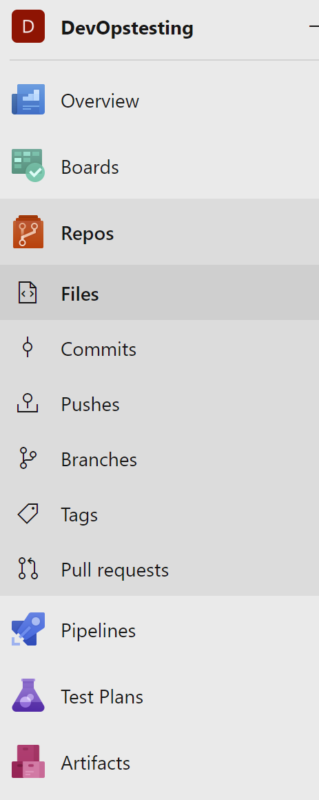

# Designing and Implementing Microsoft DevOps Solutions

## Get started on managing team members
(to be edited)
## Work items
(to be edited)
## Get started on Azure Repo
### Creating project
      Select the organization name
	  click on new project button
	  Fill in the required fields
	  Save
Now you can manage the project members and permission under the proejct setting.
### Project/organization Setting
### Clone from Repo to visual studio

      At the menu side , click on Repo -> files
      click on clone button and copy the link 
      Open visual studio and select clone from repo then paste url
### Push new project from visual studio to Azure Repo
Create new project on your local machine and run these lines

      git remote add origin (url)
	  git push -u origin --all
### Branching
### Pull request
## Implement CI withAzure Pipeline
(to be edited)
### Agent pools
### Pipelines
### Release 
